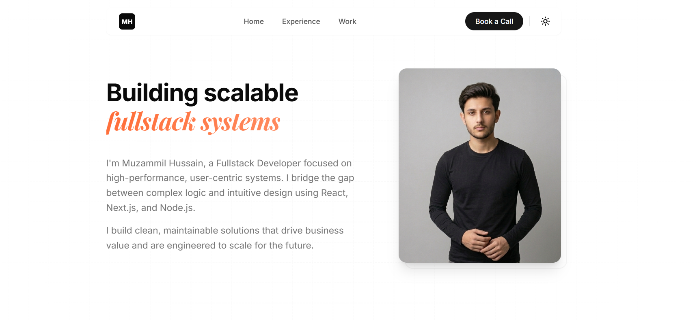

<div align="center">

</div>

# Portfolio Template

Built with **Next.js**, **shadcn/ui**, and **MotionX UI**.

A high-performance, ultra-premium developer portfolio template designed to showcase your professional journey with a focus on immersive aesthetics and fluid interactions.

## 🚀 Features

- **Quick Setup**: Setup only takes a few minutes by editing the [single config file](./src/data/resume.tsx)
- **Modern Stack**: Built using Next.js, React, Typescript, Shadcn/UI, TailwindCSS, Motion, and MotionX UI
- **Book a Call**: Integrated Cal.com scheduling with seamless UI sync
- **Adaptive Theming**: Smooth Light and Dark mode functionality that works across the entire site
- **Fully Responsive**: Optimized for all devices and screen sizes
- **Deployment Ready**: Optimized for Next.js and Vercel out of the box

## 📦 Getting Started

### 1. Clone the repository
```bash
git clone https://github.com/muzammil-15/portfolio-template
cd portfolio-template
```

### 2. Install dependencies
```bash
pnpm install
```

### 3. Environment Setup
Create a `.env` file in the root directory (or use `.env.local`):
```bash
NEXT_PUBLIC_CAL_LINK="your-cal-link/username"
NEXT_PUBLIC_CAL_NAMESPACE="portfolio"
```

### 4. Personalize your content
Open [src/data/resume.tsx](./src/data/resume.tsx) and update the `DATA` object with your details, projects, and social links. This is the only file you need to edit to get started!

### 5. Run locally
```bash
pnpm dev
```

## 🎨 Customization

- **Global Styles**: Modify the palette in [src/app/globals.css](./src/app/globals.css).
- **Section Layouts**: Each section is a modular component located in `src/components/section/`.
- **Icons**: Extended icon set available in `src/components/icons.tsx`.

## 📄 License

Licensed under the MIT License - feel free to build upon this template for your personal use.